# HTTP-Directory-Enumeration-with-Dirb-and-CURL
Let's see how to enumerate HTTP with Dirb and CURL
# Introduction of the tool
## Dirb
DIRB is a Web Content Scanner. It looks for existing (and/or hidden) Web Objects. It basically works by launching a dictionary based attack against a web server and analyzing the responses.  
DIRB comes with a set of preconfigured attack wordlists for easy usage but you can use your custom wordlists. Also DIRB sometimes can be used as a classic CGI scanner, but remember that it is a content scanner not a vulnerability scanner. 
DIRB’s main purpose is to help in professional web application auditing. Specially in security related testing. It covers some holes not covered by classic web vulnerability scanners. DIRB looks for specific web objects that other generic CGI scanners can’t look for. It doesn’t search vulnerabilities nor does it look for web contents that can be vulnerable.

### MANUAL:
NAME
       dirb - Web Content Scanner

SYNOPSIS
       dirb <url_base> <url_base> [<wordlist_file(s)>] [options]

DESCRIPTION
       DIRB  IS  a  Web Content Scanner. It looks for existing (and/or hidden)
       Web Objects. It basically works by launching a dictionary basesd attack
       against a web server and analizing the response.

### OPTIONS
       -a <agent_string>
              Specify your custom USER_AGENT.  (Default is: "Mozilla/4.0 (com-
              patible; MSIE 6.0; Windows NT 5.1)")

       -b     Don't squash or merge sequences of /../ or /./ in the given URL.

       -c <cookie_string>
              Set a cookie for the HTTP request.

       -E <certificate>
              Use the specified client certificate file.

       -f     Fine tunning of NOT_FOUND (404) detection.

       -H <header_string>
              Add a custom header to the HTTP request.

       -i     Use case-insensitive Search.

       -l     Print "Location" header when found.

       -N <nf_code>
              Ignore responses with this HTTP code.

       -o <output_file>
              Save output to disk.

       -p <proxy[:port]>
              Use this proxy. (Default port is 1080)

       -P <proxy_username:proxy_password>
              Proxy Authentication.

       -r     Don't Search Recursively.

       -R     Interactive Recursion.  (Ask in which directories  you  want  to
              scan)

       -S     Silent Mode. Don't show tested words. (For dumb terminals)

       -t     Don't force an ending '/' on URLs.

       -u <username:password>
              Username and password to use.

       -v     Show Also Not Existent Pages.

       -w     Don't Stop on WARNING messages.

       -x <extensions_file>
              Amplify search with the extensions on this file.

       -X <extensions>
              Amplify search with this extensions.

       -z <milisecs>
              Amplify search with this extensions.

## CURL
CURL is a command line tool for transferring data with URL syntax, supporting DICT, FILE, FTP, FTPS, GOPHER, HTTP, HTTPS, IMAP, IMAPS, LDAP, LDAPS, POP3, POP3S, RTMP, RTSP, SCP, SFTP, SMTP, SMTPS, TELNET and TFTP. 
curl supports SSL certificates, HTTP POST, HTTP PUT, FTP uploading, HTTP form based upload, proxies, cookies, user+password authentication (Basic, Digest, NTLM, Negotiate, kerberos…), file transfer resume, proxy tunneling and a busload of other useful tricks.

### Usage: curl [options...] <url>
  - -d, --data <data>          **HTTP POST data**
  - -f, --fail                 **Fail fast with no output on HTTP errors**
  - -h, --help <category>      **Get help for commands**
  - -i, --include              **Include protocol response headers in the output**
  - -o, --output <file>        **Write to file instead of stdout**
  - -O, --remote-name          **Write output to a file named as the remote file**
  - -s, --silent               **Silent mode**
  - -T, --upload-file <file>   **Transfer local FILE to destination**
  - -u, --user <user:password> **Server user and password**
  - -A, --user-agent <name>    **Send User-Agent <name> to server**
  - -v, --verbose              **Make the operation more talkative**
  - -V, --version              **Show version number and quit**

This is not the full help, this menu is stripped into categories.
Use "--help category" to get an overview of all categories.
For all options use the manual or "--help all".

## Example Directory enumeration with Dirb  
**Target 192.29.104.3**
 - dirb http://192.29.104.3 
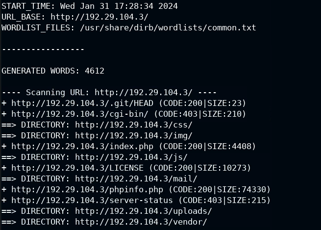  

## Example Directory enumeration with curl  
**Target 192.29.104.3**
### curl requests on 192.29.104.3
 - curl -X GET 192.29.104.3 **(GET REQUEST)**  
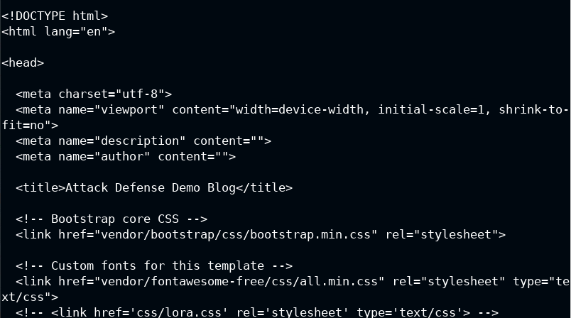   
 - curl -I 192.29.104.3 **(HEAD REQUEST)**  
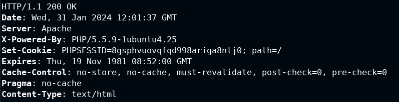  
 - curl -X OPTIONS 192.29.104.3 -v **(OPTIONS REQUEST)**  
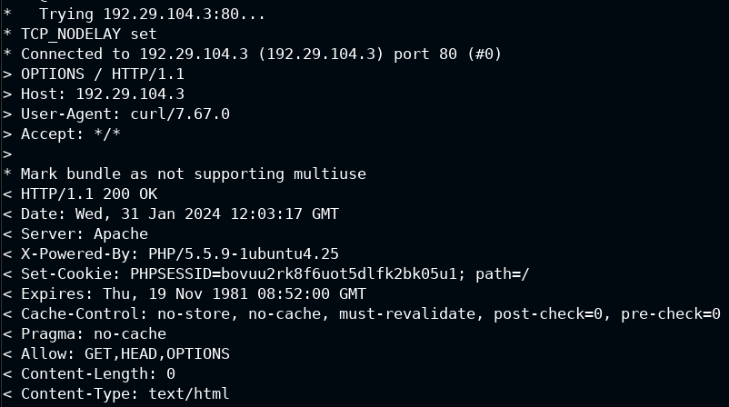  
 - curl -X POST 192.29.104.3 **(POST REQUEST)**  
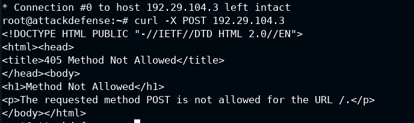  
 - curl -X PUT 192.29.104.3 **(PUT REQUEST)**  
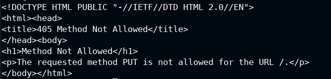  
### curl requests on 192.29.104.3/login.php
 - curl -X OPTIONS 192.29.104.3/login.php **(OPTIONS REQUEST ON LOGIN.PHP)**  
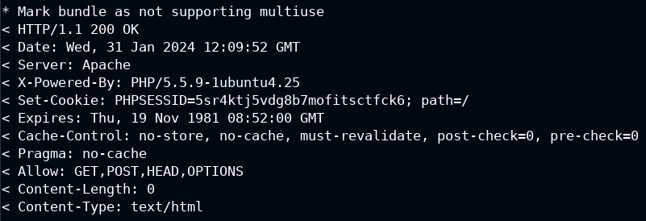  
 - curl -X POST 192.29.104.3/login.php **(POST REQUEST ON LOGIN.PHP)**  
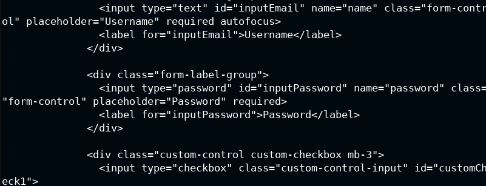  
 - curl -X POST 192.29.104.3/login.php -d "name=john&password=password" -v **(POST REQUEST ON LOGIN.PHP WITH CREDENTIALS)**  
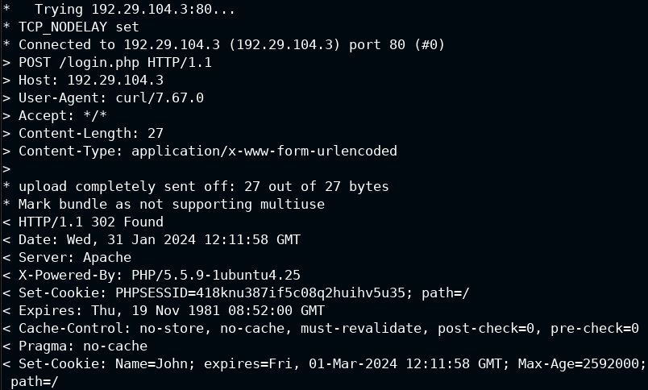  
### curl requests on 192.29.104.3/post.php
 - curl -X OPTIONS 192.29.104.3/post.php **(OPTIONS REQUEST ON POST.PHP)**  
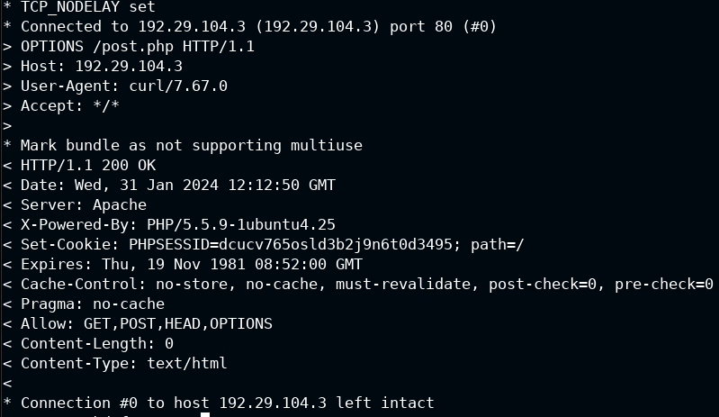  
### curl requests on 192.29.104.3/uploads/
 - curl -X OPTIONS 192.29.104.3/uploads/ -v **(OPTIONS REQUEST ON UPLOADS DIRECTORY)**  
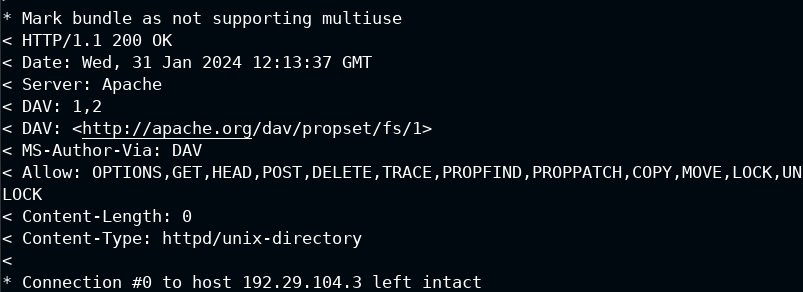  

**Creation a txt file and upload it to the directory /uploads/**
 - echo "Hello World" > hello.txt **(CREATION A RANDOM TXT)**  
 - curl 192.29.104.3/uploads/ --upload-file hello.txt **(UPLOAD REQUEST ON THE DIRECTORY UPLOADS)**  
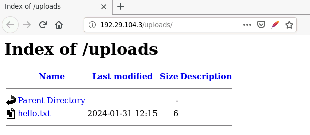  
 - curl -X DELETE 192.29.104.3/uploads/hello.txt **(DELETE REQUEST ON THE DIRECTORY UPLOADS OF THE FILE hello.txt)**  
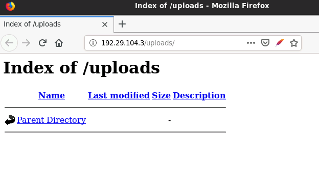   

### Summary:
Use dirb to find the directory hidden and not with a dictionary. Then use curl (options request) to enumerate the methods allowed, and use the allowed methods to enumerate, enumerate and enumerate... or maybe to upload a reverse shell or any desired operation allowed.

#Author
<b>Xiao Li Savio Feng</b>
